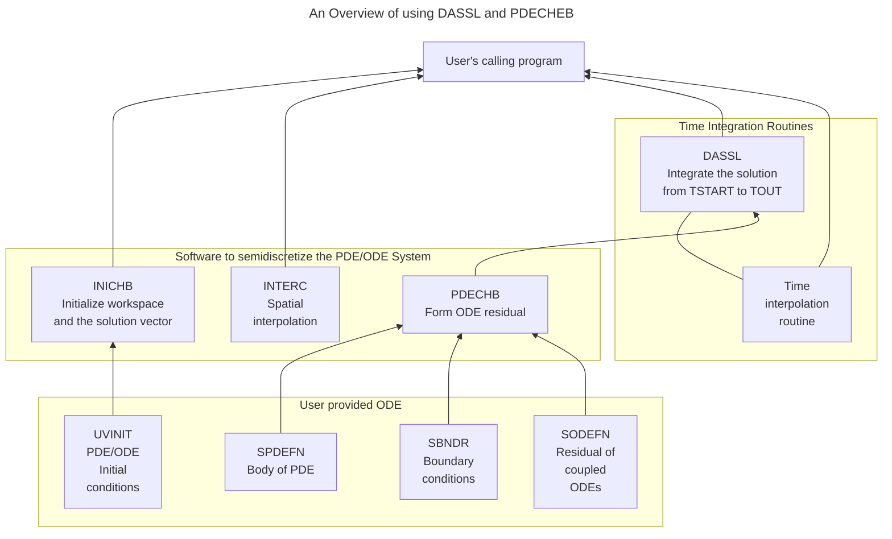

```mermaid
---
title: An Overview of using DASSL and PDECHEB
---
flowchart BT

    subgraph L4[User provided ODE]
        l4_1[UVINIT\nPDE/ODE\nInitial\nconditions]
        l4_2[SPDEFN\nBody of PDE]
        l4_3[SBNDR\nBoundary\nconditions]
        l4_4[SODEFN\nResidual of\ncoupled\nODEs]
    end

    subgraph L3["Software to semidiscretize the PDE/ODE System"]
        l3_1[INICHB\nInitialize workspace\nand the solution vector]
        l3_2[PDECHB\nForm ODE residual]
        l3_3[INTERC\nSpatial\ninterpolation]
    end
    l4_1-->l3_1
    l4_2-->l3_2
    l4_3-->l3_2
    l4_4-->l3_2

    subgraph L2 ["Time Integration Routines"]
        direction RL
        l2_1[DASSL\nIntegrate the solution\nfrom TSTART to TOUT]
        l2_2[Time\ninterpolation\nroutine]
        l2_2---l2_1
    end
    l3_2-->l2_1

    L1[User's calling program]
    
    l3_1-->L1
    l3_3-->L1
    l2_1-->L1
    l2_2-->L1
```