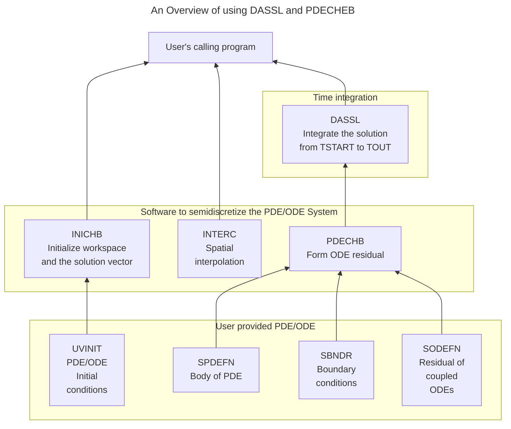
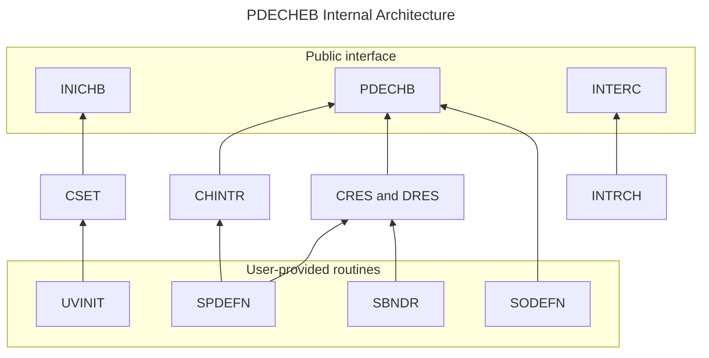

```mermaid
---
title: An Overview of using DASSL and PDECHEB
---
flowchart BT

    subgraph L4[User provided PDE/ODE]
        l4_1[UVINIT\nPDE/ODE\nInitial\nconditions]
        l4_2[SPDEFN\nBody of PDE]
        l4_3[SBNDR\nBoundary\nconditions]
        l4_4[SODEFN\nResidual of\ncoupled\nODEs]
    end

    subgraph L3["Software to semidiscretize the PDE/ODE System"]
        l3_1[INICHB\nInitialize workspace\nand the solution vector]
        l3_2[PDECHB\nForm ODE residual]
        l3_3[INTERC\nSpatial\ninterpolation]
    end
    l4_1-->l3_1
    l4_2-->l3_2
    l4_3-->l3_2
    l4_4-->l3_2

    subgraph L2[Time integration]
        l2_1[DASSL\nIntegrate the solution\nfrom TSTART to TOUT]
    end
    l3_2-->l2_1

    L1[User's calling program]
    
    l3_1-->L1
    l3_3-->L1
    l2_1-->L1
```

```mermaid
---
title: PDECHEB Internal Architecture
---
graph BT

    subgraph A[Public interface]
        A2[INICHB]
        A1[PDECHB]
        A3[INTERC]
    end

    B1[CHINTR]-->A1
    B2[CRES and DRES]-->A1

    subgraph U["User-provided routines"]
        U1[SPDEFN]
        U2[SBNDR]
        U3[SODEFN]
        U4[UVINIT]
    end

    U1-->B2
    U2-->B2

    U1-->B1
    U3-->A1

    C1[INTRCH]-->A3
    U4-->C2[CSET]-->A2
```
